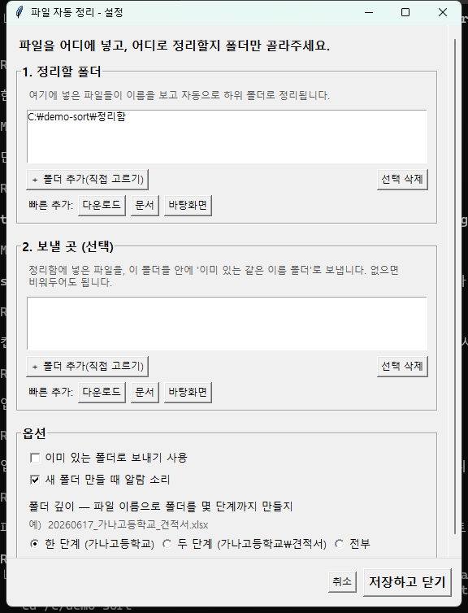

# 파일 자동 정리 (File Auto-Sort)

> 폴더에 떨어지는 파일을 이름 기반 규칙으로 하위 폴더에 자동 분류해주는 Windows 백그라운드 유틸리티.
> 컴퓨터에 익숙하지 않은 실사용자의 실제 요청으로 만들어, 현재 사용 중입니다.

## 스크린샷



*설정 화면 — 정리할 폴더·보낼 곳 지정, 폴더 깊이 규칙 (그림의 예시는 가상 명칭)*

## 왜 만들었나

각 학교 및 기관별 파일이 누적되는데, 매번 수동으로 폴더를 나눠 옮기는 것이 번거롭다는 요청에서 출발했습니다.
설치·설정 없이, 파일만 한 폴더에 넣으면 알아서 분류되는 것을 목표로 했습니다.

## 주요 기능

- **폴더 실시간 감시 (watchdog)** — 새 파일이 들어오면 이름의 단어/확장자로 하위 폴더를 자동 생성·이동
- **안전 우선 설계**
  - `연습 모드`: 실제로 옮기지 않고 "어디로 갈지"만 먼저 보여줌 (첫 실행 기본값)
  - `되돌리기`: 방금 정리한 것 원복 (최근 100건 — 실행 중 메모리에만 보관, 프로그램을 다시 켜면 초기화)
  - `시스템 폴더 보호`: C:\ 루트·Windows·Program Files 등은 감시 대상에서 자동 차단
  - `덮어쓰기 방지`: 동일 이름은 `파일 (1)` 로 보관
- **트레이 상주 실행** + 우클릭 메뉴 (일시정지·연습모드·자동시작·되돌리기·종료)
- **Windows 토스트 알림** / 새 폴더 생성 시 확인 창
- **규칙(rules.txt) 실시간 반영** — 저장하면 재시작 없이 즉시 적용
- **견고성 디테일**
  - 파일 크기가 안정될 때까지(0.5초 간격으로 2회 연속 같은 크기, 최대 30초) 기다렸다 이동 → 쓰는 중인 파일 이동을 줄임. 30초를 넘겨도 계속 커지는 파일은 이동을 시도하며, 이때는 보통 Windows 공유 위반으로 실패해 로그에 남음
  - 임시/잠금 파일(`.tmp`, `.crdownload`, `~$` …) 자동 무시
  - OneDrive로 리디렉션된 한글 폴더(다운로드/문서/바탕 화면)까지 인식
- **선택 라이브러리 부재 시 자동 강등(graceful degradation)** — 트레이/토스트/GUI가 없으면 콘솔 모드로 동작

## 동작 방식 (간략)

`watchdog` Observer가 감시 폴더의 파일 생성 이벤트를 큐에 넣고,
워커 스레드 1개가 `match_folder()`(규칙 → 확장자 → 이름 자동분류) 로 목적지를 정한 뒤,
락으로 이동·되돌리기를 직렬화한 상태에서 `shutil.move` 로 옮기고 undo 스택에 기록합니다.
락은 프로그램 내부 스레드 간 순서만 보장합니다. 이동 자체는 같은 드라이브 안에서는 이름 변경이지만,
'보낼 곳'이 다른 드라이브면 복사 후 삭제라서 원자적이지 않습니다.

## 기술 스택

Python 3 / watchdog / pystray / Pillow / tkinter / winotify / winsound / winreg
패키징: PyInstaller (`--onefile`)

## 실행 방법

**소스로 실행**
```bash
pip install watchdog pystray pillow winotify
python auto_sort.py
```
(또는 Windows에서 `실행하기.bat` 더블클릭 — 필요한 패키지 자동 설치 후 실행)

**EXE로 빌드** (파이썬 없는 PC 배포용)
```
빌드하기.bat 실행  →  배포용 폴더 생성
```

## 비개발자용 사용 안내

`받는분_읽어주세요.txt` 참고 (설정 창에서 버튼으로 폴더만 고르면 됨).

## 한계 / TODO

- Windows 전용 (트레이·토스트·레지스트리 자동시작이 Windows API 기반)
- 단위 테스트 미작성 → 추가 예정
- 이름 기반 자동 분류라, 파일명이 불규칙하면 폴더가 잘게 나뉠 수 있음 (rules.txt 로 예외 지정 가능)
- 되돌리기 기록이 파일로 남지 않아 재시작 후에는 되돌릴 수 없음
- 다른 드라이브로 보내는 이동은 복사+삭제라 중단 시 원본과 사본이 함께 남을 수 있음
- 목적지 이름 충돌 검사(`파일 (1)`)는 검사 후 이동 사이에 외부 프로세스가 같은 이름을 만들면 놓칠 수 있음

## License

MIT
